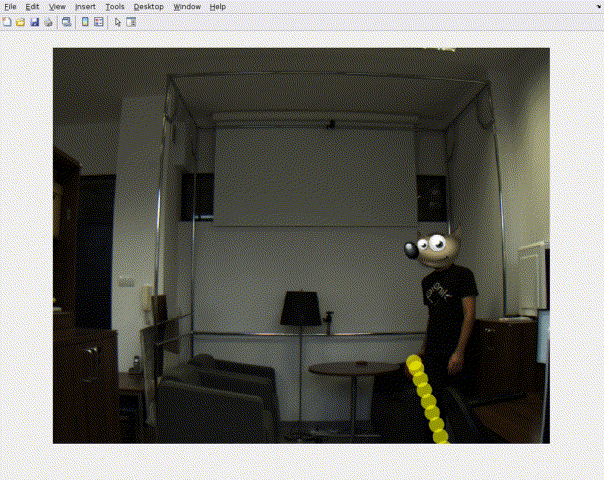

# Trajectory Estimator
The goal of the project is to detect the ball being thrown towards the camera/robot and calculate its trajectory. It has been made after following the *Computer Vision* course at Warsaw University of Technology.

## Task solution
The solution uses a sequence of images representing a ball being thrown toward a camera. The trajectory is then estimated through its approximation to a matematical function. 
The images used in the task for the calibration of the camera and the ones representing the trajectories are available at [this link](https://1drv.ms/u/s!AtugSPMAHs8nhB0Fqc61TqDq2rz2?e=n7WKke/). The solution works indeed  with a sequence that has to be already present in a folder. Nevertheless, with just lesser modifications it would be possible to calculate the trajectory in real-time. 
An example of the code behaviour is shown in the image below.

## Used tools
The code has been implemented in MATLAB using some already existing toolboxes. Specifically, the code use the following ones:
- Image Processing Toolbox
- Computer Vision Toolbox

## Usage
To run the code in a matlab environment you need to run this command:

`main("images/main/folder", "path/to/trajectory", ball_size, "path/to/calibration_images" | calibrated_model, chessboard_pattern_size);`

where:
- "images/main/folder" is the root folder of the images folders (calibration + training)
- "path/to/trajectory" (from the "images/main/folder") is the path of the folder containing the images of the trajectory
- ball_size is the size of the ball in real world (in mm)
- "path/to/calibration_images" (from the "images/main/folder") is the path of the folder containing the calibration images. Optionally, you can also/instead pass a precalibrated model
- chessboard_pattern_size is the size of a square in the calibration images (in mm)

After first run, you can take the result value of the function (the camera parameters) and use them to perform another run/estimation substituing "camera_model" to "path/to/calibration_images":

`main("images/main/folder", "path/to/trajectory", ball_size, camera_model, chessboard_pattern_size);`